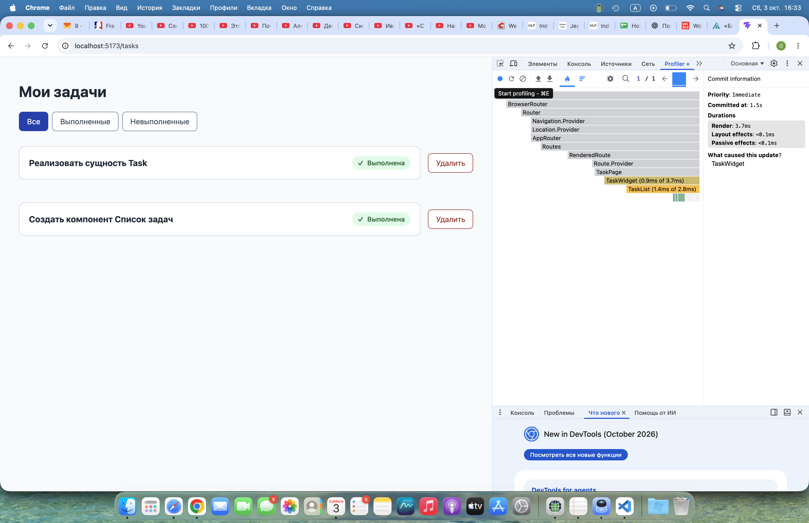
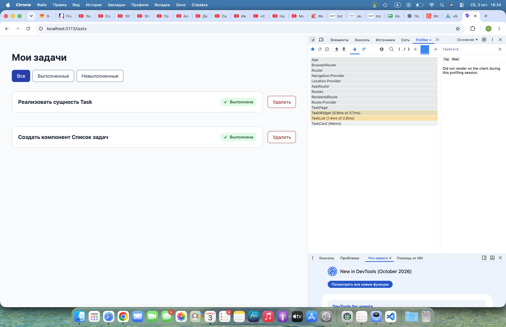
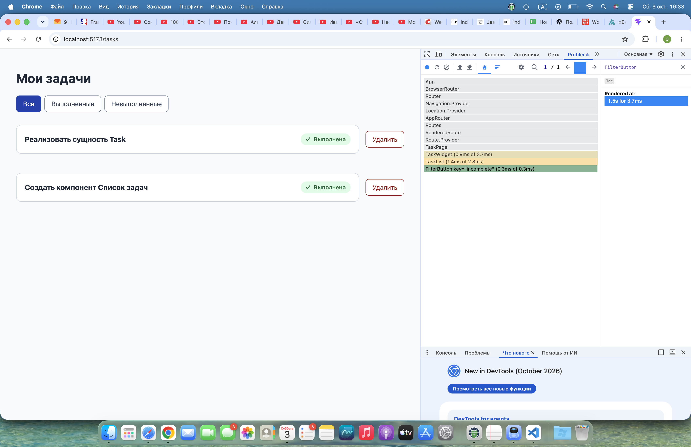

# LESSON-2 — Оптимизация производительности

Ветка: `lesson-2`. База PR: `main`. Приложение находится в корне репозитория.

## Что сделано

`TaskCard` обёрнут в `React.memo`. При фильтрации и удалении ссылки на
неизменённые объекты задач сохраняются, что позволяет пропускать повторные
рендеры карточек с прежними props.

В `useTasks` фильтрация по статусам `all`, `completed`, `incomplete`
мемоизирована через `useMemo` с зависимостями `[allTasks, filter]`.
Начальные данные заданы локальным массивом внутри хука.

Функция `removeTask` обёрнута в `useCallback`. Функциональное обновление
состояния позволяет работать с актуальным списком и сохранять ссылку
на обработчик между рендерами.

Исправлено замечание первого урока: `useTasks` вызывается в `TaskWidget`,
а список, фильтр и обработчики передаются в `TaskList` через props.
Приложение перенесено из `lesson-1/` в корень репозитория.

## Чек-лист

- [x] Обернуть `TaskCard` в `React.memo` и сохранить стабильность props.
- [x] Проверить отсутствие повторных рендеров карточек при неизменных props.
- [x] Мемоизировать фильтрацию через `useMemo`.
- [x] Разместить начальные данные внутри `useTasks`.
- [x] Мемоизировать `removeTask` через `useCallback` и передать через props.
- [x] Проверить удаление, смену фильтра, одну задачу и пустой список.
- [x] Выполнить проверку TypeScript, сборку, ESLint и Prettier.
- [x] Добавить снимки React DevTools Profiler и анализ компонентов.

## Профилирование в React DevTools

На снимках показан один commit после удаления задачи № 3 в фильтре «Все».
Длительность рендера commit — 3,7 мс. Это измерение текущей версии
в режиме разработки, а не сравнение скорости до и после оптимизации.



**TaskWidget и TaskList.** Источником обновления указан `TaskWidget`,
в котором хранится состояние хука. Собственное время рендера виджета —
0,9 мс, списка — 1,4 мс. Оба компонента рендерятся при изменении задач:
виджет получает новое состояние, список отображает результат удаления.



**TaskCard.** Выбранная карточка помечена `Memo`; Profiler сообщает,
что она не рендерилась за время записи. Карточка сохранилась на экране,
а её объект `task` не изменился. Это демонстрирует результат оптимизации:
обновление списка не требует повторного рендера этой карточки.



**FilterButton.** Кнопка «Невыполненные» участвовала в обновлении,
её время рендера — 0,3 мс, хотя выбранным остался фильтр «Все».
Здесь остаётся возможность оптимизации: компонент не мемоизирован,
а `TaskList` при каждом рендере создаёт новый обработчик `onClick`.
Для пропуска такого рендера понадобятся и `memo`, и стабильные props;
по одному короткому рендеру необходимость этой оптимизации не следует.

## Запуск и проверки

Node.js: `^20.19.0 || >=22.12.0`; `.nvmrc` выбирает ветку 22.
Команды выполняются из корня репозитория:

```sh
nvm use
npm ci
npm run dev
```

Страница приложения: `/tasks`.

```sh
npm run build
npm run lint
npm run format:check
```

Общая проверка: `npm run check`. Сборка, TypeScript, ESLint и Prettier проходят успешно.

## Ключевые файлы

- [TaskCard](src/entities/task/ui/TaskCard.tsx) — мемоизированная карточка.
- [useTasks](src/features/taskList/model/useTasks.ts) — состояние, фильтрация и удаление.
- [TaskWidget](src/widgets/task/ui/TaskWidget.tsx) — вызов хука и передача props.
- [TaskList](src/features/taskList/ui/TaskList.tsx) — список задач и фильтры.
- [package.json](package.json) — скрипты и окружение.
- [package-lock.json](package-lock.json) — зафиксированные зависимости.
